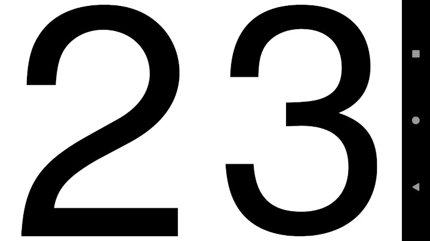
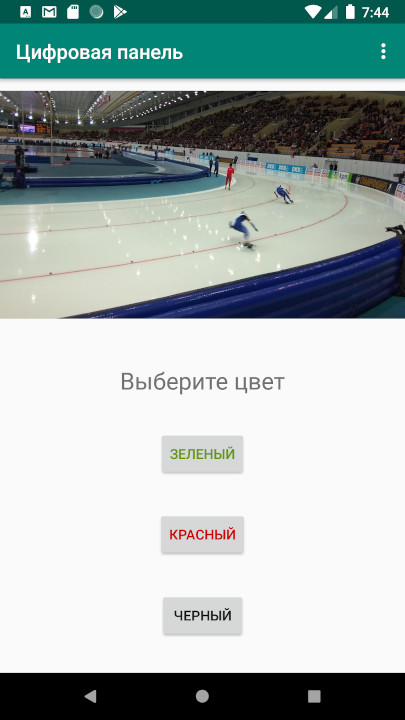

# Android Digital Panel  

  

## Summary  

Ski competitions and trainings are more efficient if ski-runner may know the result of each circle. Trainer may help him with showing this result.
Android Digital Panel allows to shows in fullscreen two digits of each ski-runner circle result. 
Color of digits are chosen according to color of ski-runner. 
  
## Screenshots  

   
   