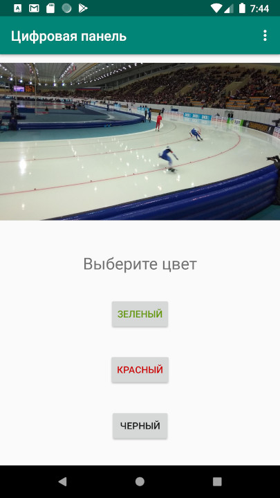

# Цифровая панель android  

  

## Краткое описание  

Цифровая панель android отображает две цифры на экране устройства в полноэкранном режиме
На соревнованиях или тренировке по конькобежному спорту спортсмену не всегда удобно самому контролировать время прохождения каждого круга. 
В этом ему помогает тренер или партнер, который фиксирует время и доводит его до спортсмена с помощью табло. 
На экране устройства отражаются последние две значащие цифры времени прохождения круга. 
В зависимости от того, насколько успешно была пройдена дистанция, можно выбрать зеленый или красный цвет цифр.

## Скриншоты  

